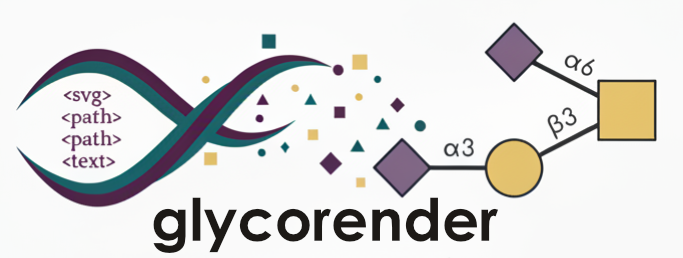

<p align="center">
  
</p>

# glycorender

A bespoke SVG to PDF/PNG renderer for the GlycoDraw platform, specialized in accurately rendering glycan structures with support for chemical notations and path-based text positioning.

[](https://pypi.org/project/glycorender/)
[](https://pypi.org/project/glycorender/)
[](LICENSE)

## Features

- Accurate SVG to PDF and PNG conversion for glycan structures
- Support for text on paths with proper positioning and orientation
- Special handling for monosaccharide properties like "Df" with proper styling
- Gradient fills for circles and shapes
- Precise connection path rendering between glycan elements
- Support for various SVG path commands

## Installation

```bash
pip install glycorender
```

## Quick Start

```python
from glycorender import convert_svg_to_pdf, convert_svg_to_png

# Convert SVG file to PDF
with open('glycan_structure.svg', 'r') as f:
    svg_data = f.read()
    
convert_svg_to_pdf(svg_data, 'output.pdf')

# Convert SVG file to PNG
convert_svg_to_png(svg_data, 'output.png')

# Or directly from SVG data
svg_data = """..."""
convert_svg_to_pdf(svg_data, 'output.pdf')
convert_svg_to_png(svg_data, 'output.png')
```

## Use Cases

GlycoRender is specifically designed for:

- Converting glycan structure diagrams from GlycoDraw to publication-quality PDFs or PNGs
- Preserving the exact layout and styling of complex carbohydrate representations
- Ensuring chemical notations are properly formatted in the output
- Maintaining the correct connections between monosaccharide units

## API Reference

### `convert_svg_to_pdf(svg_data, pdf_file_path, return_canvas=False, chem=False, shadow=False, sticker=False)`
Renders SVG data to a PDF with embedded, subset fonts.

### `convert_svg_to_png(svg_data, png_file_path=None, output_width=None, output_height=None, scale=None, return_bytes=False, chem=False, background=None, shadow=False, sticker=False)`
Renders SVG data to a PNG. `scale` multiplies the page size (1.0 is 72 dpi, `300 / 72` is 300 dpi), and the resolution is stored in the file, so the PNG is placed at the same physical size as the PDF. `background=None` keeps the background transparent.

Parameters shared by both:
- `svg_data` (str or bytes): SVG content
- `shadow` (bool or dict): soft drop shadow under the monosaccharide symbols; a dict overrides `dx`, `dy`, `blur`, `alpha`, `color`
- `sticker` (bool or dict): die-cut outline around the whole structure; a dict overrides `width`, `color`, `edge`, `edge_color`, `shadow`
- `chem` (bool): the input is an RDKit SVG

### `pdf_to_svg_bytes(svg_string, shadow=False, sticker=False)`
Returns an SVG that looks exactly like the PDF, with text as outlines.

### `simple_svg_to_pdf(svg_data, pdf_path)` / `simple_svg_to_png(svg_data, png_path)`
Render a general matplotlib-style SVG (e.g., a figure with embedded glycans) without glycan-specific handling.

## Supported SVG Elements

- `<path>`: Full support for path commands (M, L, H, V, Z, etc.)
- `<circle>`: Support for basic circles and gradient-filled circles
- `<rect>`: Support for rectangles with stroke and fill
- `<text>` and `<textPath>`: Support for text placement along paths with proper orientation
- `<defs>`: Support for path and gradient definitions
- `<radialGradient>`: Support for radial gradients with stops

## Dependencies

- `numpy`

## Contributing

Contributions are welcome! Please feel free to submit a Pull Request.

## License

This project is licensed under the MIT License - see the [LICENSE](LICENSE) file for details.